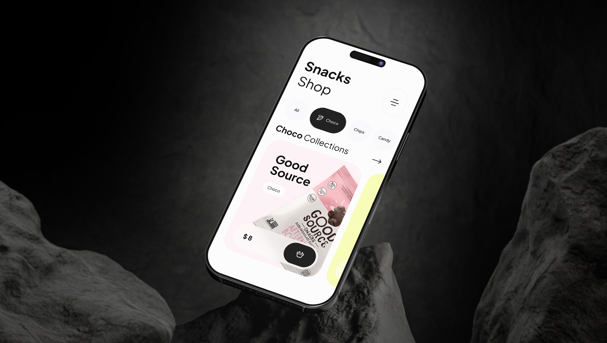

# Snacks Shop Project

## Description
Snacks Shop is a mobile application built with SwiftUI for easy selection and purchase of snacks. The first version includes basic functionality for viewing categories, products, and detailed product information.

## Architecture
The project follows the MVVM architectural pattern, ensuring scalability and testability.

### Main Components:
- **View** — Responsible for displaying data and handling user interactions.
  - `HomeView.swift` — Main screen displaying categories and product lists.
  - `CategoryView.swift` — Category selection.
  - `ProductView.swift` — Product list.
  - `ProductCardView.swift` — Product card.
  - `DetailsProductView.swift` — Detailed product information.
- **ViewModel** — Manages the presentation logic and connects the model with the view.
  - `ProductViewModel.swift` (Handles product loading and filtering)
  - `CartManager.swift` (Manages the shopping cart)
- **Model** — Contains business logic and data.
  - `ProductModel.swift` (Data structure for products)
  - `CategoryModel.swift` (Data structure for categories)

## Installation
1. Clone the repository:
   ```sh
   git clone https://github.com/Yuldshev/SnacksShop_App
   ```
2. Open the project in Xcode:
   ```sh
   open SnacksShop.xcodeproj
   ```
3. Run the project on a simulator or device.

## Planned Updates
Future versions will include:
- Authentication (Auth)
- User Profile (Profile)
- Menu Screen (MenuView)
- Order Screen (OrderView)

## Figma Design Link
[[Figma design link here]](https://www.figma.com/design/VJ1VvY3D8ytTvdsEjnXSOH/SnachShop?node-id=67-421&t=oBN2wGTzxIqj1GbV-1)

